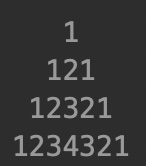

1. Realiza el control de acceso a una zona secreta. El programa nos pedirá la combinación para entrar. Si no acertamos, se nos mostrará el mensaje “Lo siento, no puedes entrar” y si acertamos mostrará “PUEDES PASAR”. Los requisitos del programa son:
  - La combinación será un número de 4 cifras.
  - Tendremos cuatro oportunidades para abrir la caja fuerte.
  - Si metemos un número con cifras no válidas, eso no cuenta como intento.

2. Escribe un programa que calcule la media de una serie de números introducidos por teclado. El usuario indicará que ha terminado de introducir los datos cuando meta un número negativo. Los requisitos son:
	- Los números deben ser positivos.

3. Escribe un programa que pida dos números por teclado: base, de tipo real y  exponente de tipo entero y positivo, y a continuación muestre por pantalla todas las potencias con base el numero dado y exponentes entre uno y el exponente introducido. Por ejemplo, si introducimos el 2 y el 5, se deberán mostrar 2^1, 2^2, 2^3, 2^4 y 2^5. Los requisitos son:
  - No se deben utilizar funciones de Java para el cálculo de potencias. 
  - Se debe comprobar que el exponente es positivo.

4. Escribe un programa que compruebe si un número introducido por teclado es o no primo. Un número primo es aquel que sólo es divisible entre él mismo y la unidad. Los requisitos son:
  - Se debe comprobar que el número introducido es positivo.


5. Escribe un programa que sume los 100 números siguientes a un número entero y positivo introducido por teclado. Los requisitos son:
  - Se debe comprobar que el número introducido es positivo.

6. Escribe un programa que obtenga los números enteros comprendidos entre dos números introducidos por teclado.  El programa debe empezar por el menor de los enteros introducidos e ir incrementando de 1 en 1 hasta alcanzar el valor mayor. Los requisitos son:
  - Se debe comprobar que los números introducidos son positivos y distintos.

7. Escribe un programa que vaya pidiendo números hasta que se introduzca un numero negativo y nos diga cuántos números se han introducido, la media de los impares y el mayor de los pares. El número negativo sólo se utiliza para indicar el final de la introducción de datos pero no hay que incluirlo en los cálculos.

8. (NIVEL PRO) Escribe un programa que lea un número n e imprima una pirámide de números con n filas como en la siguiente figura:




9. (NIVEL PRO) Escribe un programa que muestre por pantalla todos los números primos entre 2 y 100, ambos incluidos.

10. (NIVEL PRO) Escribe un programa que, dado un número entero positivo, diga cuáles son y cuánto suman los dígitos pares. Los dígitos pares se deben mostrar en orden, de izquierda a derecha. Usa long en lugar de int donde sea necesario para admitir números largos.


Ejemplo 1:

```
Por favor, introduzca un número entero positivo: 94026782
Dígitos pares: 4 0 2 6 8 2
Suma de los dígitos pares: 22
```
Ejemplo 2:

```
Por favor, introduzca un número entero positivo: 31779
Dígitos pares:
Suma de los dígitos pares: 0
```
Ejemplo 3:

```
Por favor, introduzca un número entero positivo: 2404
Dígitos pares: 2 4 0 4
Suma de los dígitos pares: 10
```
