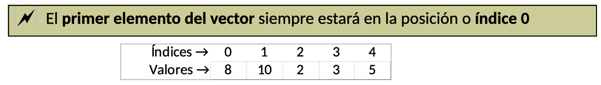
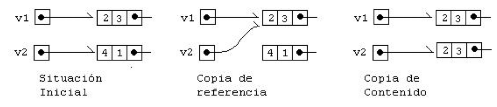

## 1. Introducción
> Un array o vector es una colección de valores de un mismo tipo dentro de una misma variable. De forma que se puede acceder a cada valor independientemente. 

Para Java, además, un array es un objeto que tiene propiedades que se pueden manipular.
Los arrays solucionan problemas concernientes al manejo de muchas variables que se refieren a datos similares.  
Por ejemplo si tuviéramos la necesidad de almacenar las notas de una clase con 18 alumnos, necesitaríamos 18 variables, con la tremenda lentitud de manejo que supone eso. Solamente calcular la nota media requeriría una tremenda línea de código. Almacenar las notas supondría al menos 18 líneas de código.
En lugar de crear 18 variables sería mucho mejor crear un array de tamaño 18 (es como si tuviéramos una sola variable que puede almacenar varios valores).

Gracias a los arrays se puede crear un conjunto de variables con el mismo nombre. La diferencia será que un número (índice del array) distinguirá a cada variable.


## 2. Propiedades
Algunas propiedades de los arrays son:
- Los arrays se utilizan como contenedores para almacenar datos relacionados (en lugar de declarar variables por separado para cada uno de los elementos del array).
- Todos los datos incluidos en el array son del mismo tipo. Se pueden crear arrays de enteros de tipo int o de reales de tipo float, pero en un mismo array no se pueden mezclar tipos de datos, por ej. int y  float.
- El tamaño del array se establece cuando se crea el array (con el operador new, igual que cualquier otro objeto).
- Los arrays unidimensionales se conocen con el nombre de vectores.
- Los arrays bidimensionales se conocen con el nombre de matrices.

## 3. Vectores (Arrays unidimensionales)
### 3.1  Declaración
Un array se declara de forma similar a una variable simple pero añadiendo corchetes para indicar que se trata de un array y no de una variable simple del tipo especificado.

Un Vector (array unidimensional) se puede declarar de dos formas:  

- tipo identificador[];  
- tipo[] identificador;

Donde tipo es el tipo de dato de los elementos del vector e identificador es el nombre de la variable.

Ejemplos:
- int notas[];
- double cuentas[];

Declara un array de tipo int y otro de tipo double. Esta declaración indica para qué servirá el array, pero no reserva espacio en la memoria RAM al no saberse todavía el tamaño del mismo. Todavía no puede utilizarse el array, falta instanciarlo.

### 3.2  Instancia
Tras la declaración del array, se tiene que instanciar, para ello se utiliza el operador new, que es el que realmente crea el array indicando un tamaño. Cuando se usa new, es cuando se reserva el espacio necesario en memoria. Un array no inicializado es un array null (sin valor).

Ejemplo:

    int notas[]; // Declaramos ‘notas’ como array de tipo int
	notas = new int[3]; // Instanciamos ‘notas’ a tamaño 3

	// Es habitual declarar e instanciar en una sola línea  
	int notas[] = new int[3];

En el ejemplo anterior se crea un array de tres enteros (con los tipos básicos se crea en memoria el array y se inicializan los valores, los números se inicializan a 0).

### 3.3  Almacenamiento
Los valores del array se asignan (almacenan) utilizando el índice del mismo entre corchetes. 




Por ejemplo, para almacenar el valor 8 en la tercera posición del array escribiríamos:
	notas[2] = 8;

También se pueden asignar valores al array en la propia declaración e instanciación:

    int notas[] = {8, 10, 2, 3, 5};
	int notas2[]= new int[] {8, 10, 2, 3, 5}; //Equivalente a la anterior

Esto declara e inicializa un array de tres elementos. El ejemplo sería equivalente a:

	notas[0] = 8;
	notas[1] = 10;
	notas[2] = 2;
	notas[3] = 3;
	notas[4] = 5;

En Java (como en otros lenguajes) el primer elemento de un array está en la posición cero. El primer elemento del array notas, es notas[0].

> Se pueden declarar arrays a cualquier tipo de datos (enteros, booleanos, doubles, ... e incluso objetos).

### 3.4  Longitud de un vector
Los arrays poseen una propiedad llamada length que indica su tamaño.

Ejemplo:

	int notas[] = new int[4]; // Declara e instancia vector tipo int de tamaño 4
	System.out.println( notas.length ); // Mostrará un 4

Si el vector tiene como en el ejemplo 4 elementos, la propiedad length nos devolverá el valor entero 4, pero su primer elemento se encuentra en notas[0] y el último en notas[3].

 3.5  Recorrido de un vector
Para recorrer un vector (acceder a todos sus elementos) siempre será necesario un bucle.
En el siguiente ejemplo declaramos e instanciamos un vector tipo int con las notas de un alumno y luego utilizamos un bucle for para recorrer el vector y mostrar todos los elementos.

	// Declaramos e instanciamos vector tipo int
	int notas[] = new int[] {7, 3, 9, 6, 5};

	// Como el vector es de tamaño 5 sus elementos estarán en las posiciones de 0 a 4
	// Recorremos el vector desde i=0 hasta i<5 (es decir, desde 0 hasta 4)
	for (int i = 0; i < notas.length; i++) {
		System.out.println(notas[i]);
	}

Ahora vamos a calcular la nota media (sumar todas y luego dividir entre el número de notas):

	// Declaramos suma y media
	int suma = 0;
	int media;

	// Recorremos el vector desde 0 hasta 4, acumulando las notas en suma
	for (int i = 0; i < notas.length; i++) {
		suma += notas[i];    // Equivale a: suma = suma + notas[i]
	}
	
	// Calculamos la media y la mostramos por pantalla
	media = suma / notas.length;
	System.out.println(“La nota media es: “ + media);


### 3.6  Copia de vectores
Para copiar vectores no basta con igualar un vector a otro como si fuera una variable simple.

Si partimos de dos vectores v1, v2 e hiciéramos v2=v1, lo que ocurriría sería que v2 apuntaría a la posición de memoria de v1. Eso es lo que se denomina un copia de referencia:



Si por ejemplo queremos copiar todos los elementos del vector v2 en el vector v1, existen dos formas para hacerlo:

**- Copiar los elementos uno a uno**
```java
	for (i = 0; i < v1.length; i++)
		v2[i] = v1[i];
```

**- Utilizar la función arraycopy**

```java
System.arraycopy(v_origen, i_origen,  v_destino, i_destino, length);
	v_origen: Vector orígen
	i_origen: Posición inicial de la copia
	v_destino: Vector destino
	i_destino: Posición final de la copia
	length: Cantidad de elementos a copiar

	// Copiamos todos los elementos de v1 en v2
	System.arraycopy(v1, 0, v2, 0, v1.length);
```

## EJERCICIOS INICIALES

1. Crea un programa que pida diez números reales por teclado, los almacene en un array, y luego muestre todos sus valores.

####SOLUCIÓN
```java

import java.util.Scanner;


public class ejercicio01 {	
	
	public static void main (String[] args) {	
		
		Scanner sc  = new Scanner(System.in);
		//Creo la variable y la instancio
		int numeros[] = new int[10];		
		
		for (int i=1; i<10; i++) {
			System.out.println("Introduce valor " + (i+1) + ": ");
			numeros[i] = sc.nextInt();
		}
		
		System.out.println ("Valores :" );
		for (int i=0; i<10; i++) {
			System.out.println("Valor " + (i+1) + ": " + numeros[i]);
		}	
		
	}
}
```


3. Crea un programa que pida diez números reales por teclado, los almacene en un array, y luego muestre la suma de todos los valores.
4. Crea un programa que pida diez números reales por teclado, los almacene en un array, y luego lo recorra para averiguar el máximo y mínimo y mostrarlos por pantalla.
5. Crea un programa que pida veinte números enteros por teclado, los almacene en un array y luego muestre por separado la suma de todos los valores positivos y negativos.
6. Crea un programa que pida veinte números reales por teclado, los almacene en un array y luego lo recorra para calcular y mostrar la media: (suma de valores) / nº de valores. 
7. Crea un programa que pida dos valores enteros N y M, luego cree un array de tamaño N, escriba M en todas sus posiciones y lo muestre por pantalla.
8. Crea un programa que pida dos valores enteros P y Q, luego cree un array que contenga todos los valores desde P hasta Q, y lo muestre por pantalla.
