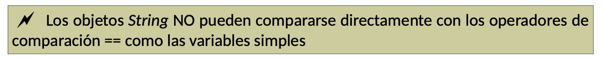

##1. LA CLASE STRING
Las cadenas de texto son objetos especiales. Los textos deben manejarse creando objetos de tipo String.

Ejemplo:

  `String texto1 = “¡Prueba de texto!”;`

Las cadenas pueden ocupar varias líneas utilizando el operador de concatenación “+”.

```java
  String texto2 =”Este es un texto que ocupa “ +
  “varias líneas, no obstante se puede “+
  “perfectamente encadenar”;
```

También se pueden crear objetos String sin utilizar constantes entrecomilladas, usando otros constructores:

```java
  char[] palabra = {‘P’, ’a’, ’l’, ’a’, ’b’, ’r’, ’a’}; 
  // Array de char 
  String cadena = new   String(palabra);
```




## 2. MÉTODOS COMUNES

Algunos de los métodos más utilizados son:

- **valueOf** : Convierte valores que no son de cadena a forma de cadena.

```java
  String numero = String.valueOf(1234); 
  // Convierte el número int 1234 en el String “1234”
```

- **length** : Devuelve la longitud de una cadena (el número de caracteres de la cadena): 

```java
  String texto1=”Prueba”;
  System.out.println(texto1.length()); 
  // Escribe un 6
```

- **charAt** : Devuelve un carácter concreto de la cadena. El carácter a devolver se indica por su posición (el primer carácter es la posición 0). Si la posición es negativa o sobrepasa el tamaño de la cadena, ocurre un error de ejecución, una excepción tipo `IndexOutOfBounds-Exception` (recuerda este tipo de error, se repetirá muchas veces).

```java
  String s1=”Prueba”;
  char c1 = s1.charAt(2); // c1 valdrá ‘u’
```

- **substring** : Da como resultado una porción del texto de la cadena. La porción se toma desde una posición inicial hasta una posición final (sin incluir esa posición final). Si las posiciones indicadas no son válidas ocurre una excepción de tipo IndexOutOfBounds-Exception. Se empieza a contar desde la posición cero.

```java
  String s1=”Buenos días”;
  String s2=s1.substring(7,10); // s2 = “día”
```

- indexOf : Devuelve la primera posición en la que aparece un determinado texto en la cadena. En el caso de que la cadena buscada no se encuentre, devuelve -1.
El texto a buscar puede ser char o String.

```java
  String s1=”Quería decirte que quiero que te vayas”; 
  System.out.println(s1.indexOf(“que”)); // Devuelve 15
```

También se puede buscar desde una determinada posición:

```java
  String s1=”Quería decirte que quiero que te vayas”; 
  System.out.println(s1.indexOf(“que”,16)); // Ahora devolvería 26
```

- **lastIndexOf** : Devuelve la última posición en la que aparece un determinado texto en la cadena. Es casi idéntica a la anterior, sólo que busca desde el final.

```java
  String s1=”Quería decirte que quiero que te vayas”; 
  System.out.println(s1.lastIndexOf(“que”); //Devolvería 26
```

También permite comenzar a buscar desde una determinada posición. 

- **endsWith** : Devuelve true si la cadena termina con un determinado texto.

```java
  String s1=”Quería decirte que quiero que te vayas”; 
  System.out.println(s1.endsWith(“vayas”); //Devolvería true
```

- **startsWith** : Devuelve true si la cadena empieza con un determinado texto. 

```java
  String s1=”Quería decirte que quiero que te vayas”;
  System.out.println(s1.startsWith(“vayas”); // Devolvería false
```

- **replace**: Cambia todas las apariciones de un carácter (o caracteres) por otro/s en el texto que se indique y lo almacena como resultado. El texto original no se cambia, por lo que hay que asignar el resultado de replace a un String para almacenar el texto cambiado.

  Ejemplo1

```java
String s1=”Mariposa”;
System.out.println(s1.replace(‘a’, ’e’)); //Devuelve “Meripose” System.out.println(s1); //Sigue valiendo “Mariposa”
```

  Para guardar el valor deberíamos hacer:

```java
  String s2 = s1.replace(‘a’,’e’);
```
 
  Ejemplo2:

```java
  String s1=”Buscar armadillos”;
  System.out.println(s1.replace(“ar”,”er”)); //Devuelve “Buscer ermadillos”     
  System.out.println(s1); //Sigue valiendo “Buscar armadilos”
```

- **toUpperCase** : Obtiene la versión en mayúsculas de la cadena. Es capaz de transformar todos los caracteres nacionales:

```java
  String s1 = "Batallón de cigüeñas";
  System.out.println(s1.toUpperCase()); //Escribe: BATALLÓN DE CIGÜEÑAS
```

- **toLowerCase** : Obtiene la versión en minúsculas de la cadena.

- **ToCharArray** : Consigue un array de caracteres a partir de una cadena. De esa forma podemos utilizar las características de los arrays para manipular el texto, lo cual puede ser interesante para manipulaciones complicadas.

```java
  String s="texto de prueba"; 
  char c[]=s.toCharArray();
```

- **format** : Modifica el formato de la cadena a mostrar. Muy útil para mostrar sólo los decimales que necesitemos de un número decimal. Indicaremos “%” para indicar la parte entera más el número de decimales a mostrar seguido de una “f” :

```java
  System.out.println(String.format("%.2f", number)); // Muestra el número con dos decimales.
```

- **cadena1.equals(cadena2)**. El resultado es true si la cadena1 es igual a la cadena2. Ambas cadenas son variables de tipo String.
- **cadena1.equalsIgnoreCase(cadena2).** Como la anterior, pero en este caso no se tienen en
cuenta mayúsculas y minúsculas.
- **s1.compareTo(s2)**. Compara ambas cadenas, considerando el orden alfabético. Si la primera cadena es mayor en orden alfabético que la segunda, devuelve la diferencia positiva entre una cadena y otra, si son iguales devuelve 0 y si es la segunda la mayor, devuelve la diferencia negativa entre una cadena y otra. Hay que tener en cuenta que el orden no es el del alfabeto español, sino que usa la tabla ASCII, en esa tabla la letra ñ es mucho mayor que la o.
- **s1.compareToIgnoreCase(s2)**. Igual que la anterior, sólo que además ignora las mayúsculas.

## 3. EXPRESIONES REGULARES

Cuando queremos operar con cadenas que siguen diferentes patrones (p. ej. el DNI una fecha de nacimiento, ... )

Las expresiones regulares pueden contener:

- Caracteres. Como a, s, ñ,... y les interpreta tal cual. Si una expresión regular contuviera sólo un carácter, matches devolvería verdadero si el texto contiene sólo ese carácter. Si se ponen varios, obliga a que el texto tenga exactamente esos caracteres.
- Caracteres de control (\n,\\,....)
- Opciones de caracteres. Se ponen entre corchetes. Por ejemplo [abc] significa a, b ó c.
- Negación de caracteres. Funciona al revés impide que aparezcan los caracteres indicados. Se pone con corchetes dentro de los cuales se pone el carácter circunflejo (\^). [\^abc] significa 'ni a ni b ni c'.
- Rangos. Se ponen con guiones. Por ejemplo [a-z] significa: cualquier carácter de la a a la z.
- Intersección. Usa &&. Por ejemplo [a-x&&r-z] significa de la r a la x (intersección de ambas expresiones).
- Sustracción. Ejemplo [a-x&&[\^cde]] significa de la a a la x excepto la c, d ó e.
- Cualquier carácter. Se hace con el símbolo punto (.)
- Opcional. El símbolo ? sirve para indicar que la expresión que le antecede puede aparecer una o ninguna veces. Por ejemplo a? indica que puede aparecer la letra a o no.
- Repetición. Se usa con el asterisco (*). Indica que la expresión puede repetirse varias veces o incluso no aparecer.
- Repetición obligada. Lo hace el signo +. La expresión se repite una o más veces (pero al menos una).
- Repetición un número exacto de veces. Un número entre llaves indica las veces que se repite la expresión. Por ejemplo \d{7} significa que el texto tiene que llevar siete números (siete cifras del 0 al 9). Con una coma significa al menos, es decir \d{7,} significa al menos siete veces (podría repetirse más veces). Si aparece un segundo número indica un máximo número de veces \d{7,10} significa de siete a diez veces.

**matches** : Examina la expresión regular que recibe como parámetro (en forma de String) y devuelve verdadero si el texto que examina cumple la expresión regular. Una expresión regular es una expresión textual que utiliza símbolos especiales para hacer búsquedas avanzadas.

Un ejemplo se puede descargar en el [**siguiente enlace**](_resources/expresionesRegulares.java)