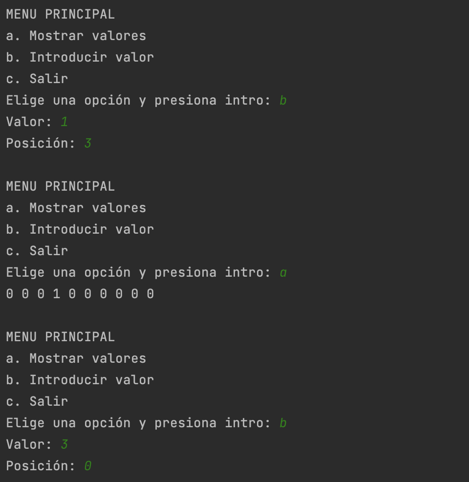

1. Escribe un programa que lea 15 números por teclado y que los almacene en un array. A continuación el programa debe rotar los elementos de ese array, es decir, el elemento de la posición 0 debe pasar a la posición 1, el de la 1 a la 2, etc. El número que se encuentra en la última posición debe pasar a la posición 0. Finalmente, muestra el contenido del array.
2. Escribe un programa que pida dos número por teclado : **N** y **M**. A continuación el programa creará un array de tamaño **N** e irá pidiendo números por pantalla, pero solo guardará en el array aquellos que sean múltiplos de **M**.
     El resultado debe ser parecido al siguiente:
     
Al final debe mostrar todo el array:

```java
Los valores introducidos son:
[6,9,3,6]
```

3. Escribe un programa que cree un array con 50 números reales de tipo double. Los números serán aleatorios entre 0.0 y 1.0, y para ello utilizaremos la instrucción `Math.random()`,  que devuelve un double entre esos valores. A continuación debe pedir al usuario un valor double R. Por último, mostrará cuántos valores del array son igual o superiores a R.
4. Escribe un programa que cree un array de enteros de tamaño 100 y lo rellene con valores enteros aleatorios entre 1 y 10 (utilizaremos la instrucción  
    `valores[i] = 1 + Math.random()*10)`. 
    Luego pedirá un valor N y mostrará en que posiciones del array aparece N.
5. Escribe un programa que cree dos arrays de enteros de tamaño 100. Luego introducirá en el primer array todos los valores del 1 al 100. Por último, deberá copiar todos los valores del primer array al segundo array en orden inverso, y mostrar ambos por pantalla.
6. Escribe un programa que cree un array de 10 enteros y luego muestre el siguiente menú con distintas opciones:
   
   ```
   a. Mostrar valores.
   b. Introducir valor.
   c. Salir.
   ```
   
La opción ‘a’ mostrará todos los valores por pantalla. La opción ‘b’ pedirá un valor V y una posición P, luego escribirá V en la posición P del array. El menú se repetirá indefinidamente hasta que el usuario elija la opción ‘c’ que terminará el programa.

Este es un ejemplo de uso:



7. (NIVEL PRO) Utilizando la clase `Arrays` y sus métodos, escribe un programa que pida al usuario 20 valores enteros e introduzca los 10 primeros en un array y los 10 últimos en otro array. Por último, comparará ambos arrays y le dirá al usuario si son iguales o no.
8. (NIVEL PRO) Utilizando la clase `Arrays` y sus métodos, escribe un programa que cree un array de tamaño 1000 y lo rellene con valores enteros aleatorios entre 0 y 99 (utilizaremos la instrucción  `Math.random()*100`). Luego pedirá por teclado un valor N y se mostrará por pantalla si N existe en el array, además de cuantas veces.